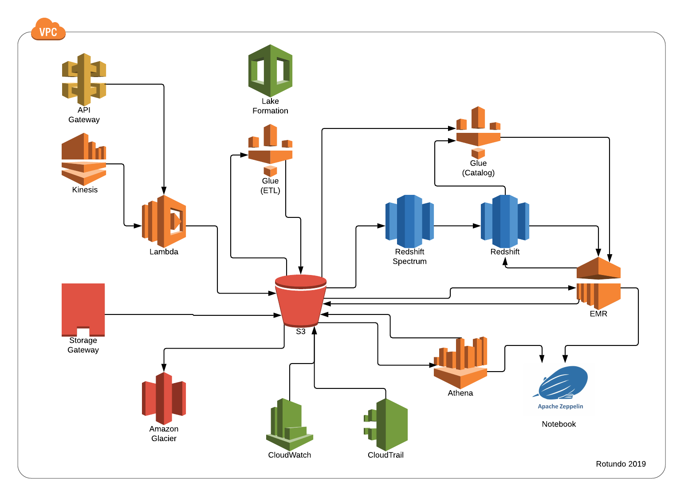

* [Introduction](#introduction)
* [Overview](#overview)
* [Detail](#detail)
* [Additional Items](#additional-items)

# Introduction

The Amazon services offering is rapidly evolving and that is exceptionally true of the big data / anayltics space. What is detailed in this document is a best approach at a general purpose data lake solution for a large enterprise. 

## Solution Areas of Concern

* Storage
* Security
* Data Processing
* Data Ingestion
* Data / Process Management
* Backup and Redundancy
* System Monitoring and Auditing
* Machine Learning 

## Implementation

The implementation of technical components of the cloud solution can be broken down into three general buckets:
* **Cloud Native** - Service offered by the cloud provider that requires zero provisioning or installation. It is entirely a managed service that only requires the configuration
* **Cloud Provisioned** - Service offered by the cloud provider that requires virtual hardware be provisioned/scaled directly by end-user to allow for its functioning.
* **Cloud Hosted** - A third party or open source technology that is hosted on the cloud, but must be maintained by the end user. This would also require that the virtual hardware be provisioned by the end user.

In many ways _cloud native_ is ideal because it requires less implementation overhead and scaling is seamless. Although the inherent risk of pure cloud native is that you are entirely dependent on the selected provider. If the services drastically change or costs become untenable, migrating out to another provider may prove difficult as their might not be 

It is important to note that due to time constraints this analysis does not factor in cost. 

# Overview

The solution would include the following Amazon technologies:
* API Gateway
* EMR
* Glue
* Lake Formation
* Lambda
* Kineisis
* Redshift
* Redshift Spectrum
* S3

## Walkthrough

Amazon has two overlapping technologies that focus on providing Data Lake functionality and management capabilities, [Glue](#glue) and [Lake Formation](#lake-formation). Glue focuses on ETL, but also provides data catalog functionality with tools to automate its upkeep.    

Lake formation is a level "above" Glue, not only concerened with the ETL processes, but the data (and access to it). 

For storage [S3](#s3) is a native cloud file storage service, it is the defacto technology for bulk data persistence in Amazon data lake solutions. For longer term bulk storage there is also [Glacier](#glacier)

Processing for more straightforward ETL tasks could be handled directly through Glue, but it does not support some more advanced features of Spark. For heavier computing loads [Elastic Map Reduce (EMR)](#elastic-map-reduce-emr) should be utilized. There is additional overhead in EMR as it does require a cluster be provisioned, but in doing so you are gaining access to a full Hadoop stack.

At the highest level the entire solution should be inside of a [Virtual Private Cloud (VPC)](#virtual-private-cloud-vpc) to isolate it from external systems. For more fine grained controls over data access **Lake Formation** provides advanced controls which tightly couple with other Amazon services. This allows for control 

## Potential Extensions
This solution is focused on ingestion and processing. While in both S3 and Redshift are readily accessible from other Amazon data services, it would make more sense to also include a standardized way to engage with a datastore that provides . These could include such relational database such as **RDS**, a NoSQL solution **DynamoDB**,  

## Integration
One of the added benefits of working in the Amazon cloud is access to a robust set of APIs

# Detail

## Data / Process Management

Lake formation is planned to be generally available starting 2019Q2, but it appears to be worth waiting for as it is positioning itself as the Amazon Data Lake management technology. 

### Glue

### Lake Formation

**Resources** 
_[Lake Formation Tech Talk](https://www.youtube.com/watch?v=nsiLMqg654s)_

## Storage

### S3

### Redshift
Redshift is a columnar store offering from Amazon. It does require provisioning of virtual cores

It is possible to dynamically scale Redshift by monitoring 

### Redshift Spectrum
Redshift Spectrum extends the capabilities of Redshift beyond the 

### Athena
While Athena is not a storage technology, it can act as a replacement for Redshift Spectrum (or other columnar store tech) by allowing for this querying behavior directly off of S3.

### Glacier
Glacier is fundamentally S3

**Resources**  
_[Redshift Spectrum vs Athena](https://blog.openbridge.com/how-is-aws-redshift-spectrum-different-than-aws-athena-9baa2566034b)_ 
_[Athena Review](https://www.youtube.com/watch?v=gGJ4zxeG9PI)_ 
_[Elastic Resize of Redshift](https://aws.amazon.com/about-aws/whats-new/2018/11/amazon-redshift-elastic-resize/)

## Security

### Virtual Private Cloud (VPC)
Enclosing the entire solution inside of a Virtual Private Cloud

### Identity Access Management (IAM)

### Lake Formation
Fine grained control over data/processing resources in other AWS services including: Athena, EMR, Glue and Redshift.

**Resources**  
_[https://aws.amazon.com/lake-formation/faqs/#Security_and_governance](Lake Formation - Security and Governance Summary)_

## Data Ingestion
### Kinesis

### Storage Gateway

### Snowball

**Resources** 
_[Data Ingestion Methods](https://docs.aws.amazon.com/aws-technical-content/latest/building-data-lakes/data-ingestion-methods.html)_

## Processing

Both Glue ETL and EMR can utilize Spark (to varying degrees). This is also helpful if processing needed to shift to different platform at some point as the Spark code should mostly transfer.

### Glue
Glue itself utilizes a limited version of Spark to handle job processing. Currently it only supports Scala and Python.

An additional feature of Glue is the introduction of the _**DynamicFrames**_ concept. This is essentially an extension of Spark's DataFrames, but allows for more flexibiltiy when handling ETL jobs that may have an input data with an inconsistent schema.

### Lambda
General purpose serverless processing. 

### Elastic Map Reduce (EMR)

**Resources**  
_[Data Pipelines w/ Glue](https://www.youtube.com/watch?v=6tBp2JuYmSg)_
 _[Glue vs Lambda for ETL](https://www.reddit.com/r/aws/comments/9umxv1/aws_glue_vs_lambda_costbenefit/)_
_[Dynamic Frames](https://docs.aws.amazon.com/glue/latest/dg/aws-glue-api-crawler-pyspark-extensions-dynamic-frame.html)_

## Backup
A simple approach to this is to ensure all data resides in S3, including backups from other storage engines (Redshift, Elasticsearch, etc.) and then have the S3 buckets replicated to Glacier

**Resources** 
_[S3 Replication To Glacier](https://stackoverflow.com/questions/15325943/can-amazon-glacier-mirror-an-amazon-s3-bucket)_

## Platform Monitoring and Auditing

### CloudWatch

**Resources**  
_[Glue Monitoring](https://docs.aws.amazon.com/glue/latest/dg/monitor-glue.html)_

# Additional Items

[Notes on building a platform to extend / manage the lake.](platform)

[Notes on setting up development processes / workflow to support data lake and platform development.](development)